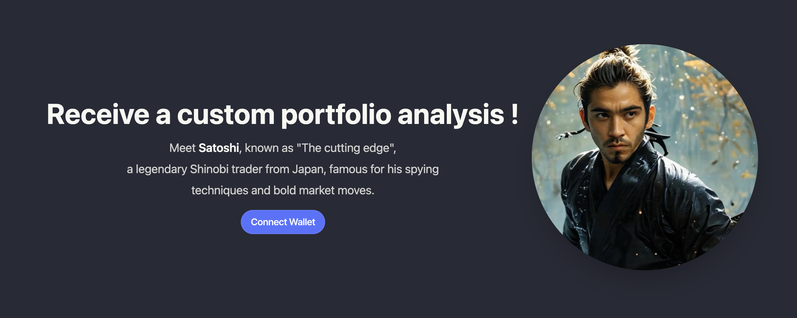

# TheAnalyst

TheAnalyst is a decentralized AI giving portfolio analysis based on the user's portfolio.
Asset managers can create their own custom prompt while keeping ownership.

[Live demo](https://tradingbro.vercel.app/)

## Stack

- OnChain AI: [Galadriel AI L1](galadriel.com)
- File ownership & storage : [Filecoin with lighthouse](lighthouse.storage)
- Frontend: react/tailwind/daisyui and web3modal for the wallet connect button.
- Api : covalent api & swap using SquidRouter